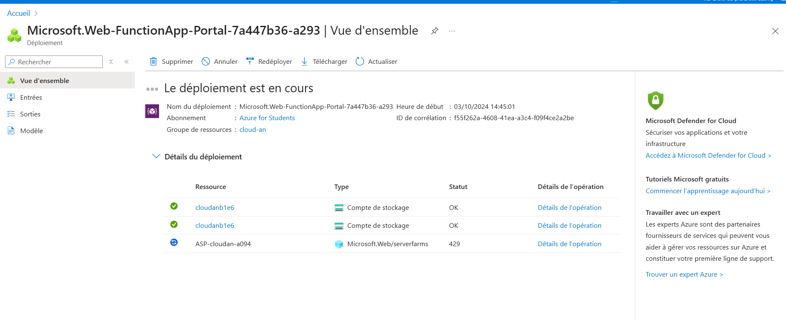
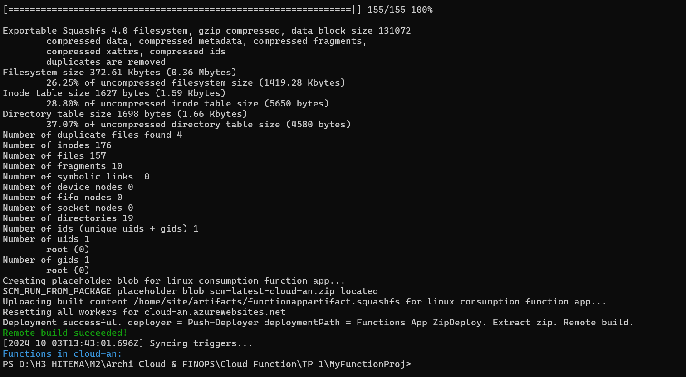

# README pour le TP 1 : Déployer une Fonction Azure Simple Déclenchée par HTTP

## Objectif
L'objectif de ce TP est de créer et déployer une fonction Azure qui répond à des requêtes HTTP, permettant ainsi de créer des applications serverless sans gestion d'infrastructure.

## Prérequis
- Un compte Microsoft Azure.
- **Azure CLI** installé sur votre machine.
- **Visual Studio Code** avec l'extension Azure Functions.
- **Python** installé sur votre machine (version 3.6 ou supérieure).

## Étape 1 : Créer une Function App sur Azure

1. **Accéder au Portail Azure**
   - Ouvrez votre navigateur et allez sur [Azure Portal](https://portal.azure.com).

2. **Créer une Function App**
   - Dans le menu de gauche, cliquez sur **Function Apps**.
   - Cliquez sur **+ Ajouter** pour créer une nouvelle application de fonction.
   - Remplissez les informations :
     - **Nom de l'application** : Choisissez un nom unique.
     - **Abonnement** : Sélectionnez votre abonnement Azure.
     - **Groupe de ressources** : Créez un nouveau groupe ou sélectionnez-en un existant.
     - **Plan d’hébergement** : Sélectionnez **Plan de consommation**.
     - **Runtime stack** : Sélectionnez **Python**.
     - **Version** : Choisissez la version de Python que vous souhaitez utiliser.
     - **Région** : Sélectionnez la région où vous souhaitez héberger votre application.
   


   - Cliquez sur **Créer**.

## Étape 2 : Initialiser le Projet de Fonction

1. **Ouvrir Visual Studio Code**
   - Assurez-vous que l'extension **Azure Functions** est installée.

2. **Créer un Nouveau Dossier pour le Projet**
   - Créez un nouveau dossier pour votre projet Azure Functions.

3. **Ouvrir le Terminal**
   - Dans Visual Studio Code, ouvrez le terminal intégré (Ctrl + `).

4. **Initialiser un Projet de Fonction**
   - Dans le terminal, exécutez la commande suivante pour initialiser un nouveau projet Azure Functions :
   ```bash
   func init --python
   ```

## Étape 3 : Créer une Fonction HTTP

1. **Créer une Fonction HTTP**
   - Exécutez la commande suivante dans le terminal pour créer une fonction qui sera déclenchée par HTTP :
   ```bash
   func new --name MyFunctionProj --template "HTTP trigger" --authlevel "anonymous"
   ```

## Étape 4 : Déployer la Fonction sur Azure

### A. Déployer via Visual Studio Code

1. **Déployer la Fonction**
   - Dans Visual Studio Code, faites un clic droit sur votre projet et sélectionnez **Déployer vers Function App**.
   - Suivez les instructions pour sélectionner votre application de fonction.

### B. Déployer via Azure CLI (Facultatif)

Si vous préférez utiliser **Azure CLI**, assurez-vous d'être dans le dossier de votre projet et exécutez la commande suivante :
```bash
func azure functionapp publish <nom-app-fonction>
```


## Étape 5 : Tester la Fonction

1. **Tester la Fonction avec un Navigateur**
   - Accédez à l'URL de votre fonction (par exemple, `https://<nomapp>.azurewebsites.net/api/MyFunctionProj`).
   - Vous devriez voir le message "Hello, World!" s'afficher.
    https://cloud-an.azurewebsites.net/
    
    


## Résolution des Problèmes

- **Erreur 404** : Vérifiez que l'URL de la fonction est correcte.
- **Erreurs d'authentification** : Assurez-vous que le niveau d'authentification est correctement configuré.


