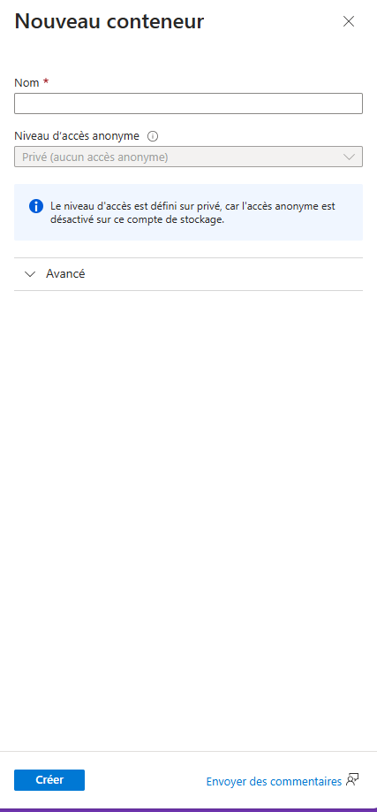
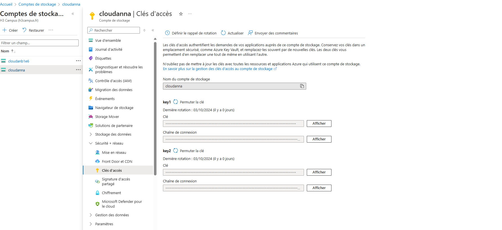
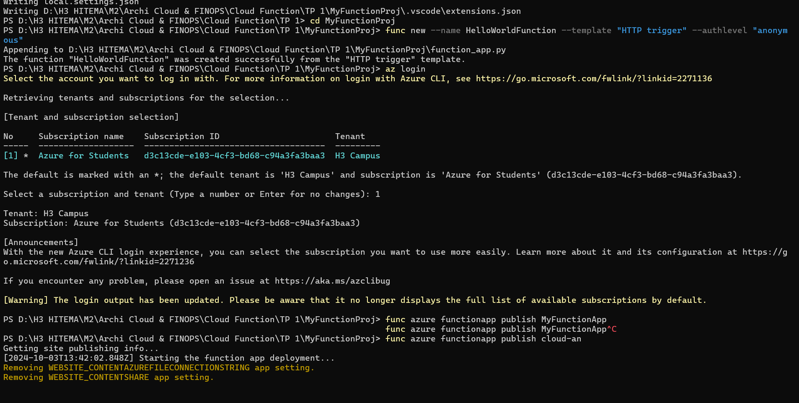

# README pour le TP 2 : Intégration avec le Stockage Azure

## Objectif
L'objectif de ce TP est d'étendre la fonction Azure créée dans le TP 1 en ajoutant la capacité d'enregistrer des logs dans **Azure Blob Storage**.

## Prérequis
- Avoir complété le TP 1.
- Un compte de stockage Azure créé dans votre abonnement Azure.

## Étape 1 : Créer un Compte de Stockage Azure

1. **Accéder au Portail Azure**
   - Ouvrez votre navigateur et allez sur [Azure Portal](https://portal.azure.com).

2. **Créer un Compte de Stockage**
   - Dans le menu de gauche, cliquez sur **Comptes de stockage**.
   - Cliquez sur **+ Ajouter**.
   - Remplissez les informations :
     - **Nom** : Choisissez un nom unique pour le compte de stockage.
     - **Type de performance** : Standard.
     - **Type de redondance** : Locally Redundant Storage (LRS).


   - Cliquez sur **Créer**.

3. **Créer un Conteneur Blob**
   - Une fois le compte de stockage créé, naviguez vers ce compte.
   - Sous l'onglet **Données**, cliquez sur **Conteneurs**.
   - Cliquez sur **+ Conteneur** et nommez-le `logs-container`.


## Étape 2 : Installer les Dépendances

1. **Installer le package `azure-storage-blob`**
   - Dans le terminal de Visual Studio Code, exécutez la commande suivante :
   ```bash
   pip install azure-storage-blob
   ```
   - Ajoutez également le package à votre fichier `requirements.txt`.

## Étape 3 : Ajouter la Chaîne de Connexion

1. **Récupérer la Chaîne de Connexion**
   - Retournez à votre **Compte de stockage** dans le portail Azure.
   - Allez dans **Clés d'accès** et copiez la **Chaîne de connexion**.

   


## Étape 4 : Déployer la Fonction sur Azure

### A. Déployer via Visual Studio Code

1. **Déployer via Azure CLI (Facultatif)**

Si vous préférez utiliser **Azure CLI**, assurez-vous d'être dans le dossier de votre projet et exécutez la commande suivante :
```bash
func azure functionapp publish <nom-app-fonction>
```


## Étape 5 : Tester la Fonction

1. **Tester la Fonction avec un Navigateur ou Postman**
   - Accédez à l'URL de votre fonction (par exemple, `https://<nomapp>.azurewebsites.net/api/HelloWorldFunction`).
   - Vérifiez dans votre **Compte de stockage** sous le conteneur `logs-container` si le fichier `logs.txt` a été créé avec les logs.

## Résolution des Problèmes

- **Pas de Logs dans `logs.txt`** : Vérifiez les permissions sur le conteneur Blob et assurez-vous que la chaîne de connexion est correcte.
- **Erreurs lors de l'écriture dans Blob Storage** : Consultez les journaux de la fonction dans le portail Azure ou via Kudu pour plus de détails.

