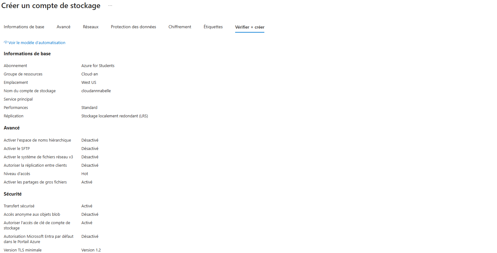
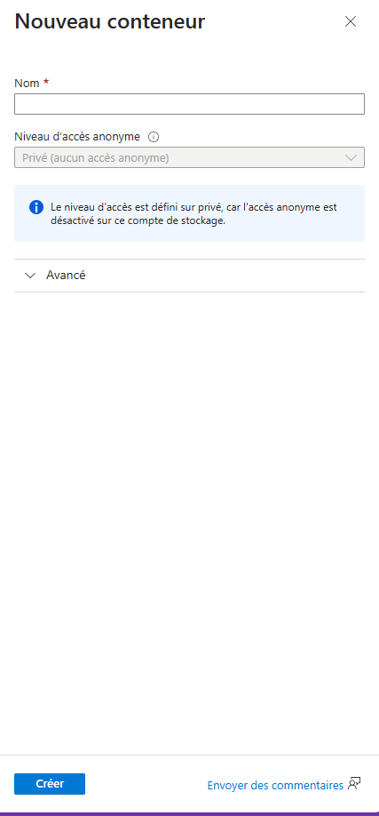
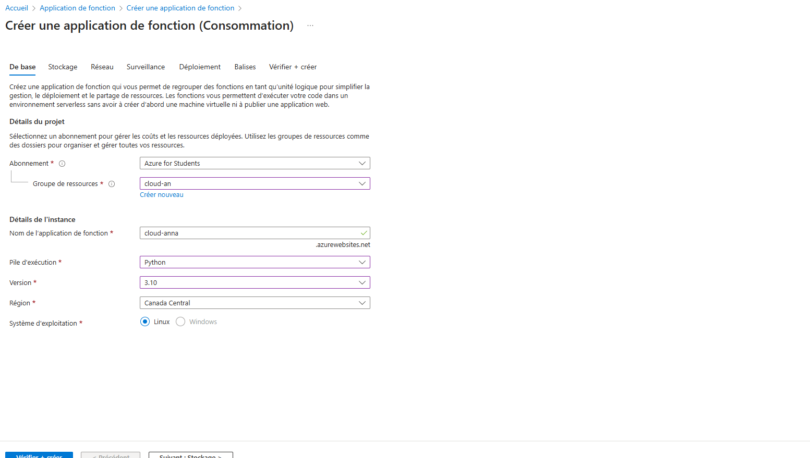
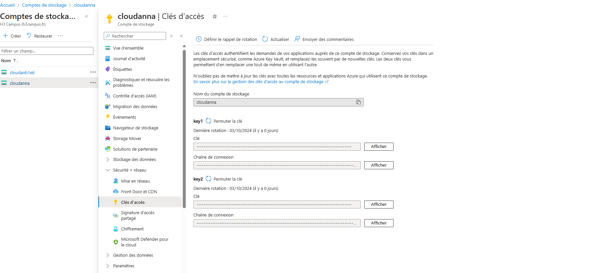
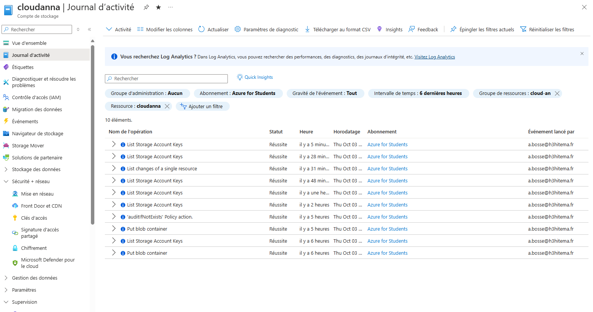
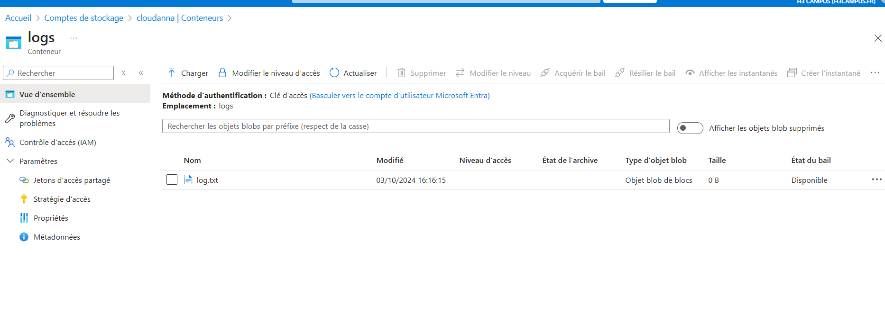

# README pour le TP 3 : Gestion des Logs avec Azure Functions

## Objectif
Ce TP a pour objectif de créer une fonction Azure qui reçoit des requêtes HTTP et enregistre les logs d'interaction dans un fichier `logs.txt` sur **Azure Blob Storage**.

## Prérequis
- Un compte Microsoft Azure.
- **Visual Studio Code** (ou un éditeur de code de votre choix) avec l'extension Azure Functions.
- **Python** installé sur votre machine (version 3.6 ou supérieure).
- Le package `azure-storage-blob` pour gérer Azure Blob Storage.

## Étape 1 : Créer un Compte de Stockage Azure

1. **Accéder au Portail Azure**
   - Ouvrez votre navigateur et allez sur [Azure Portal](https://portal.azure.com).

2. **Créer un Compte de Stockage**
   - Dans le menu de gauche, cliquez sur **Comptes de stockage**.
   - Cliquez sur **+ Ajouter**.
   - Remplissez les informations :
     - **Nom** : Choisissez un nom unique pour le compte de stockage.
     - **Type de performance** : Standard.
     - **Type de redondance** : Locally Redundant Storage (LRS).

   - Cliquez sur **Créer**.

3. **Créer un Conteneur Blob**
   - Une fois le compte de stockage créé, naviguez vers ce compte.
   - Sous l'onglet **Données**, cliquez sur **Conteneurs**.
   - Cliquez sur **+ Conteneur** et nommez-le `logs-container`.
  

## Étape 2 : Créer une Fonction Azure

1. **Créer une Function App**
   - Dans le **Portail Azure**, dans le menu de gauche, cliquez sur **Function Apps**.
   - Cliquez sur **+ Ajouter** pour créer une nouvelle application de fonction.
   - Remplissez les informations :
     - **Nom de l'application** : Choisissez un nom unique.
     - **Abonnement** : Sélectionnez votre abonnement Azure.
     - **Groupe de ressources** : Créez un nouveau groupe ou sélectionnez-en un existant.
     - **Plan d’hébergement** : Sélectionnez **Plan de consommation**.
     - **Runtime stack** : Sélectionnez **Python**.
     - **Version** : Choisissez la version de Python que vous souhaitez utiliser.
     - **Région** : Sélectionnez la région où vous souhaitez héberger votre application.


   - Cliquez sur **Créer**.

## Étape 3 : Écrire le Code de la Fonction

1. **Initialiser un Projet de Fonction**
   - Ouvrez **Visual Studio Code** et installez l'extension **Azure Functions** si ce n'est pas déjà fait.
   - Créez un nouveau dossier pour votre projet Azure Functions.
   - Ouvrez le terminal dans Visual Studio Code.

2. **Créer une Fonction HTTP**
   - Dans le terminal, tapez les commandes suivantes :
   ```bash
   func init --python
   func new --name MyFunctionProj --template "HTTP trigger" --authlevel "anonymous"
   ```


## Étape 4 : Ajouter la Chaîne de Connexion

1. **Récupérer la Chaîne de Connexion**
   - Retournez à votre **Compte de stockage** dans le portail Azure.
   - Allez dans **Clés d'accès** et copiez la **Chaîne de connexion**.
   

2. **Ajouter la Chaîne de Connexion via Azure CLI**
   - Ouvrez le terminal et assurez-vous d'être dans le dossier de votre projet Azure Functions.
   - Exécutez la commande suivante pour ajouter la chaîne de connexion en tant que paramètre d'application :
   ```bash
   func azure functionapp config appsettings set --name <nom-app-fonction> --resource-group <nom-groupe-ressource> --settings AzureWebJobsStorage=<chaîne-de-connexion>
   ```

   Remplacez `<nom-app-fonction>` et `<nom-groupe-ressource>` par les noms appropriés, et `<chaîne-de-connexion>` par la chaîne de connexion que vous avez copiée.

## Étape 5 : Déployer la Fonction sur Azure

1. **Déployer via Azure CLI**

Assurez-vous d'être dans le dossier de votre projet et exécutez la commande suivante :
```bash
func azure functionapp publish <nom-app-fonction>
```

## Étape 6 : Tester la Fonction

1. **Tester la Fonction avec un Navigateur ou Postman**
   - Accédez à l'URL de votre fonction (par exemple, `https://<nomapp>.azurewebsites.net/api/HelloWorldFunction`).
   - Vérifiez le journal d'activité dans le portail Azure pour voir si les logs sont créés.
   

2. **Vérifier les Logs dans Azure Blob Storage**
   - Retournez dans votre **Compte de stockage**.
   - Accédez à votre **Conteneur Blob** (`logs-container`).
   - Vérifiez si le fichier `logs.txt` contient les logs de vos requêtes HTTP.


## Résolution des Problèmes

- **Pas de Logs dans `logs.txt`** : Vérifiez les permissions sur le conteneur Blob et assurez-vous que la chaîne de connexion est correcte.
- **Erreurs lors de l'écriture dans Blob Storage** : Consultez les journaux de la fonction dans le portail Azure ou via Kudu pour plus de détails.
