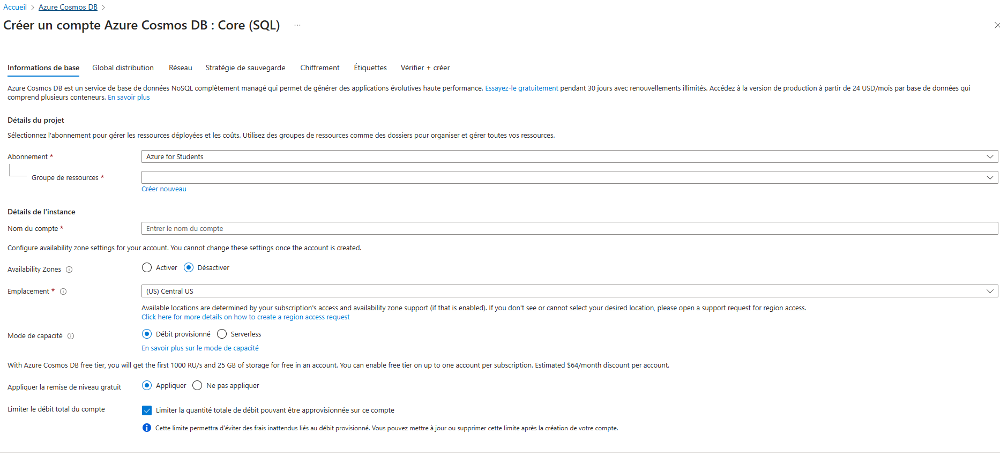
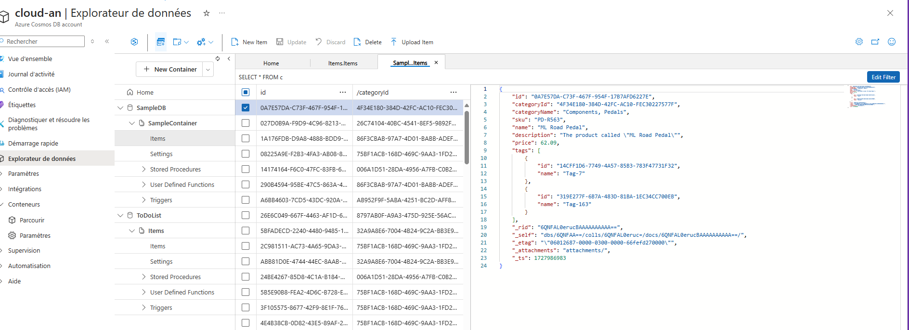

# README pour le TP : Développement d'Applications Serverless avec Azure Functions

## Objectif
Ce TP a pour objectif de créer une API serverless en utilisant **Azure Functions** qui permettra d'effectuer des opérations CRUD sur des données stockées dans **Azure Cosmos DB** ou **Azure Table Storage**.

## Prérequis
- Un compte Microsoft Azure.
- **Visual Studio Code** (ou un éditeur de code de votre choix) avec l'extension Azure Functions.
- **Python** installé sur votre machine (version 3.6 ou supérieure).
- Un compte Azure Cosmos DB ou Azure Table Storage.

## Étape 1 : Créer un Compte Azure Cosmos DB

1. **Accéder au Portail Azure**
   - Ouvrez votre navigateur et allez sur [Azure Portal](https://portal.azure.com).

2. **Créer un Compte Cosmos DB**
   - Dans le menu de gauche, cliquez sur **Azure Cosmos DB**.
   - Cliquez sur **+ Ajouter**.
   - Remplissez les informations :
     - **Nom** : Choisissez un nom unique pour le compte Cosmos DB.
     - **API** : Sélectionnez **Core (SQL)**.
     - **Abonnement** : Sélectionnez votre abonnement Azure.
     - **Groupe de ressources** : Créez un nouveau groupe ou sélectionnez-en un existant.
     - **Région** : Sélectionnez la région où vous souhaitez héberger votre base de données.
 
   - Cliquez sur **Créer**.

3. **Créer une Base de Données et une Collection**
   - Une fois le compte créé, accédez à votre **Compte Cosmos DB**.
   - Cliquez sur **Créer une base de données** et donnez-lui un nom.
   - Créez ensuite une collection à l'intérieur de cette base de données.
   

## Étape 2 : Initialiser le Projet de Fonction Azure

1. **Initialiser un Projet de Fonction**
   - Ouvrez **Visual Studio Code** et installez l'extension **Azure Functions** si ce n'est pas déjà fait.
   - Créez un nouveau dossier pour votre projet Azure Functions.
   - Ouvrez le terminal dans Visual Studio Code.

2. **Initialiser le Projet**
   - Tapez les commandes suivantes dans le terminal :
   ```bash
   func init --python
   ```

3. **Créer une Fonction HTTP**
   - Créez une nouvelle fonction qui sera déclenchée par HTTP :
   ```bash
   func new --name CrudFunction --template "HTTP trigger" --authlevel "anonymous"
   ```

## Étape 3 : Installer les Dépendances

1. **Installer le package `azure-cosmos`**
   - Dans le terminal, installez le package nécessaire pour interagir avec Azure Cosmos DB :
   ```bash
   pip install azure-cosmos
   ```
   - Ajoutez également le package à votre fichier `requirements.txt`.

## Étape 4 : Déployer la Fonction sur Azure

1. **Déployer via Azure CLI (Facultatif)**

Si vous préférez utiliser **Azure CLI**, assurez-vous d'être dans le dossier de votre projet et exécutez la commande suivante :
```bash
func azure functionapp publish <nom-app-fonction>
```

## Étape 5 : Tester la Fonction

1. **Tester la Fonction avec un Navigateur ou Postman**
   - Accédez à l'URL de votre fonction (par exemple, `https://<nomapp>.azurewebsites.net/api/CrudFunction`).
   - Utilisez **Postman** pour tester les différentes opérations :
     - **GET** : Récupérer tous les éléments.
     - **POST** : Créer un nouvel élément.
     - **PUT** : Mettre à jour un élément existant.
     - **DELETE** : Supprimer un élément.

2. **Vérifier les Logs dans Azure Cosmos DB**
   - Accédez à votre **Compte Cosmos DB**.
   - Vérifiez si les opérations CRUD fonctionnent comme prévu.

## Résolution des Problèmes

- **Pas de Logs dans Cosmos DB** : Vérifiez les permissions sur le conteneur et assurez-vous que les informations de connexion sont correctes.
- **Erreurs lors de l'exécution** : Consultez les journaux de la fonction dans le portail Azure ou via Kudu pour plus de détails.

