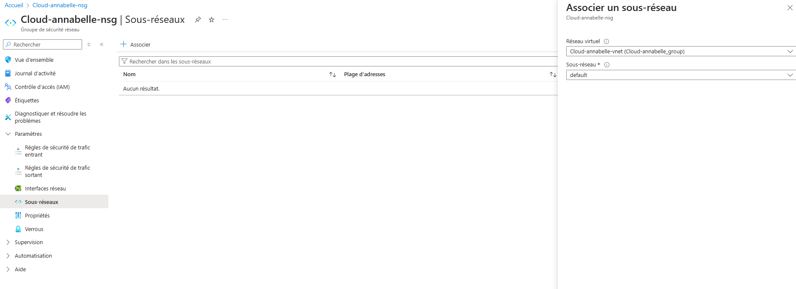
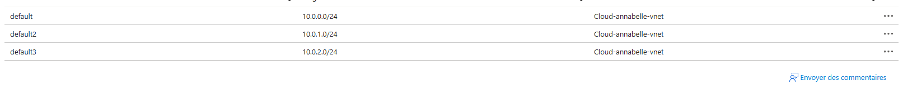

# Implémentation d'un réseau virtuel (VNet) sur Azure

Ce guide décrit en détail comment créer et configurer un **réseau virtuel (VNet)** sur Azure, avec plusieurs sous-réseaux, des **Groupes de Sécurité Réseau (NSG)**, des **machines virtuelles (VMs)** dans des sous-réseaux spécifiques, et la configuration du **peering entre deux VNets**.

---

## Prérequis

- Un compte Azure actif.
- Accès au portail Azure ([https://portal.azure.com](https://portal.azure.com)).
- Droits suffisants pour créer des ressources dans Azure.

---

## Table des matières

1. [Créer un réseau virtuel (VNet) avec plusieurs sous-réseaux](#etape-1-créer-un-réseau-virtuel-vnet-avec-plusieurs-sous-réseaux)
2. [Configurer les Groupes de Sécurité Réseau (NSG)](#etape-2-configurer-les-groupes-de-sécurité-réseau-nsg)
3. [Déployer des machines virtuelles dans les sous-réseaux](#etape-3-déployer-des-machines-virtuelles-dans-les-sous-réseaux)
4. [Configurer le peering entre deux VNets](#etape-4-configurer-le-peering-entre-deux-vnets)

---

### Étape 1 : Créer un Réseau Virtuel (VNet) avec plusieurs sous-réseaux

1. **Accédez au portail Azure** : [https://portal.azure.com](https://portal.azure.com).
2. **Créer un réseau virtuel (VNet)** :
   - Dans le menu de gauche, cliquez sur **"Réseaux virtuels"**, puis sur **"Créer"**.

3. **Configuration de base** :
   - Donnez un nom à votre réseau virtuel, sélectionnez votre groupe de ressources, la région et entrez une adresse CIDR, par exemple `10.0.0.0/16`.

4. **Ajout de sous-réseaux** :
   - Sous l'onglet **Sous-réseaux**, ajoutez des sous-réseaux. Par exemple :
     - `default 1` avec une plage d'adresses `10.0.1.0/24`.
     - ``default 2` avec une plage d'adresses `10.0.2.0/24`.

5. **Validation et création** :
   - Cliquez sur **Créer** pour finaliser la création du VNet.
---

### Étape 2 : Configurer les Groupes de Sécurité Réseau (NSG)

1. **Accéder à la section NSG** :
   - Dans le portail Azure, allez dans **Groupes de sécurité réseau**, puis cliquez sur **Créer**.

 

2. **Configurer les règles d'entrée et de sortie** :
   - Par exemple, pour autoriser le trafic SSH (port 22) ou RDP (port 3389), configurez les règles de sécurité d'entrée et sortante.
   
 

3. **Associer le NSG aux sous-réseaux** :
   - Dans les paramètres du sous-réseau (`Subnet-1`), associez le NSG créé pour gérer le trafic.

   
   

---

### Étape 3 : Déployer des Machines Virtuelles dans les Sous-Réseaux

1. **Créer une machine virtuelle** :
   - Allez dans **Machines virtuelles** et cliquez sur **Créer**. Suivez les étapes de configuration de la VM.

2. **Choisir le VNet et le sous-réseau** :
   - Dans la configuration réseau de la VM, sélectionnez le **VNet** et le **sous-réseau**.

3. **Déployer la VM** :
   - Finalisez la création et attendez que la VM soit déployée. Répétez ces étapes pour créer une autre VM dans un autre sous-réseau.

---

### Étape 4 : Configurer le Peering entre deux VNets

1. **Créer un second VNet** :
   - Suivez les mêmes étapes que l'étape 1 pour créer un deuxième réseau virtuel avec une adresse différente (par exemple, `10.1.0.0/16`).

2. **Configurer le Peering** :
   - Allez dans le premier VNet, puis dans l'onglet **Peering**, cliquez sur **Ajouter un peering**.

3. **Configuration du Peering** :
   - Donnez un nom à la connexion de peering, choisissez le second VNet et activez **Autoriser le trafic inter-VNet**.

4. **Répéter l'opération dans l'autre VNet** :
   - Allez dans le second VNet et configurez le peering vers le premier VNet pour activer la communication bidirectionnelle.

---
