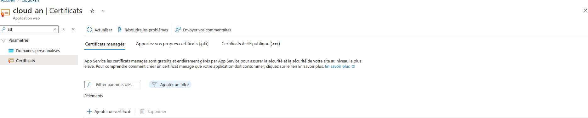

# Déploiement des applications Web Azure App Service

---
## Prérequis

- Un compte Azure actif.
- Accès au portail Azure ([https://portal.azure.com](https://portal.azure.com)).
- Droits suffisants pour créer des ressources dans Azure.

---

## Table des matières

1. Créer un plan de service Azure App Service 
2. Déployer une application Web en utilisant Azure App Service
3. Configurer des domaines personnalisés et des certificats SSL
4. Mettre en œuvre des slots de déploiement pour la mise en scène et la production

---

### Étape 1 : Créer un plan de service Azure App Service :

- Connectez-vous au portail Azure.
- Cliquez sur App Services puis sur Créer.
- Remplissez les détails requis (nom de l'application, région, etc.).

### Étape 2 : Déployer une application Web en utilisant Azure App Service :

- Utilisez l’option de déploiement, par exemple depuis GitHub ou un fichier ZIP.
- Configurez les paramètres d'application si nécessaire.

### Étape 3 : Configurer des domaines personnalisés et des certificats SSL :

- Dans les paramètres de l'App Service, ajoutez un domaine personnalisé.

- Suivez les étapes pour configurer le SSL.

### Étape 4 : Mettre en œuvre des slots de déploiement pour la mise en scène et la production :

- Dans les paramètres de l'App Service, ajoutez un nouveau slot de déploiement.

- Configurez les environnements de mise en scène.

---