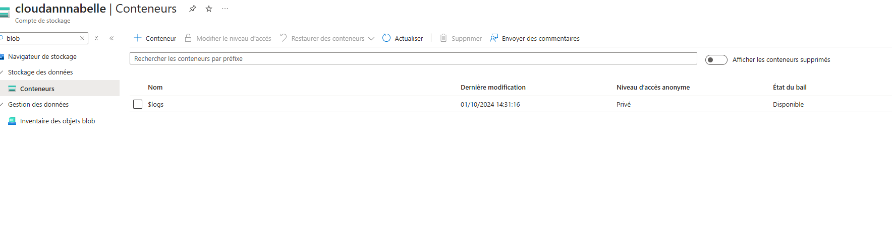

## Lab 4 : Gestion des comptes de stockage Azure et des blobs

---

## Prérequis

- Un compte Azure actif.
- Accès au portail Azure ([https://portal.azure.com](https://portal.azure.com)).
- Droits suffisants pour créer des ressources dans Azure.

---

## Table des matières

1. **Créer un compte de stockage avec différentes options de réplication**
2. **Télécharger et gérer des blobs via le portail Azure et Azure CLI**
3. **Configurer des signatures d'accès partagé (SAS) pour un accès sécurisé**
4. **Mettre en œuvre des politiques de gestion du cycle de vie**

---

### Étapes à suivre

1. **Créer un compte de stockage avec différentes options de réplication** :
   - Allez dans **Comptes de stockage**, puis cliquez sur **Créer**.
   - Choisissez le type de réplication souhaité (par exemple, LRS, GRS).


2. **Télécharger et gérer des blobs via le portail Azure et Azure CLI** :
   - Utilisez le **Portail Azure** pour créer un conteneur et télécharger des blobs.
   

   - Lister les blobs dans le conteneur :
     ```bash
    az storage blob list --account-name moncomptedestockage --container-name monconteneur --output table
     ```


3. **Configurer des signatures d'accès partagé (SAS) pour un accès sécurisé** :
   - Dans les paramètres du compte de stockage, générez une SAS.


4. **Mettre en œuvre des politiques de gestion du cycle de vie** :
   - Configurez des règles pour gérer le stockage de vos blobs (par exemple, suppression automatique).

 

---
