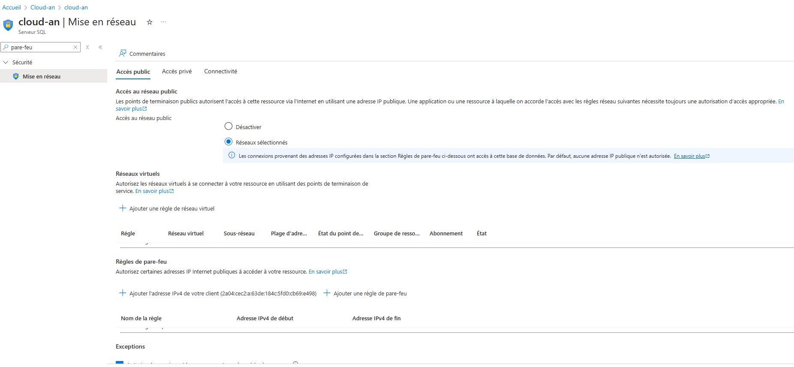

## Lab 5 : Mise en œuvre des bases de données Azure SQL

---

## Prérequis

- Un compte Azure actif.
- Accès au portail Azure ([https://portal.azure.com](https://portal.azure.com)).
- Droits suffisants pour créer des ressources dans Azure.

---

## Table des matières

1. **Déployer une instance de base de données Azure SQL**
2. **Configurer les paramètres de pare-feu pour permettre l'accès aux clients**
3. **Importer des données dans la base de données**
4. **Mettre en œuvre la géo-réplication pour la haute disponibilité**

---

### Étapes à suivre

1. **Déployer une instance de base de données Azure SQL** :
   - Allez dans **Bases de données SQL**, cliquez sur **Créer**.
   - Remplissez les informations requises.

2. **Configurer les paramètres de pare-feu pour permettre l'accès aux clients** :
   - Dans les paramètres de la base de données, ajoutez les adresses IP autorisées.
   

3. **Importer des données dans la base de données** :
   - Utilisez l'outil **Azure Data Studio** ou **SQL Server Management Studio** pour importer vos données.

4. **Mettre en œuvre la géo-réplication pour la haute disponibilité** :
   - Dans les paramètres de la base de données, activez la géo-réplication.

---
