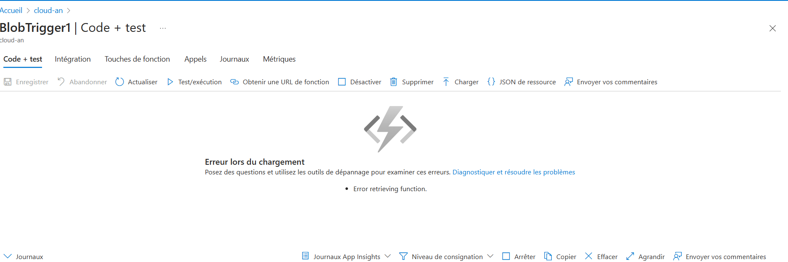

## Lab 7 : Mise en œuvre des fonctions Azure

## Prérequis

- Un compte Azure actif.
- Accès au portail Azure ([https://portal.azure.com](https://portal.azure.com)).
- Droits suffisants pour créer des ressources dans Azure.

---

## Table des matières

1. Créer une application de fonction Azure
2. Développer une fonction sans serveur déclenchée par une requête HTTP
3. Intégrer la fonction avec Azure Storage ou Azure Queue
4. Surveiller les performances et les journaux de la fonction

---

### Étapes à suivre

1. **Créer une application de fonction Azure** :
   - Allez dans **Fonctions Azure**, puis cliquez sur **Créer**.

2. **Développer une fonction sans serveur déclenchée par une requête HTTP** :
   - Créez une nouvelle fonction et sélectionnez le déclencheur HTTP.

3. **Intégrer la fonction avec Azure Storage ou Azure Queue** :
   - Configurez les liaisons pour connecter votre fonction à d'autres services Azure.

4. **Surveiller les performances et les journaux de la fonction** :
   - Utilisez **Azure Monitor** pour visualiser les performances et les journaux.

---