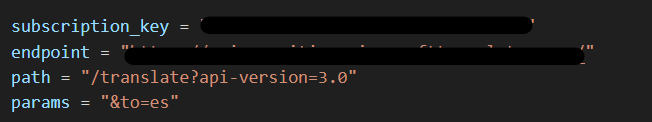
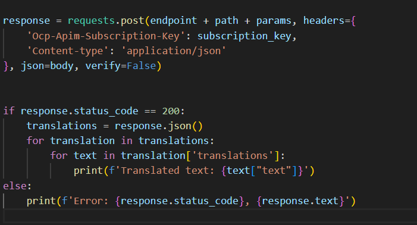
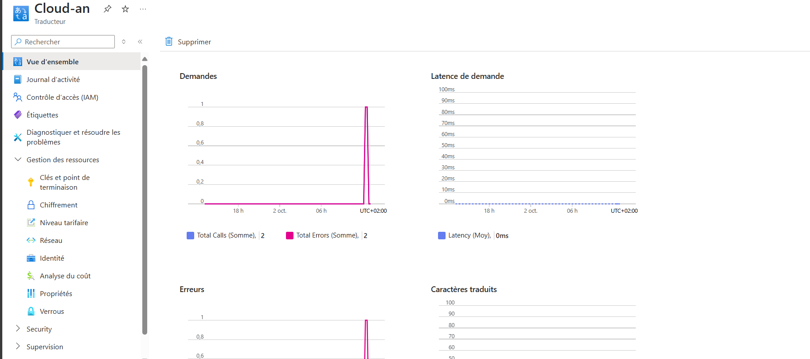
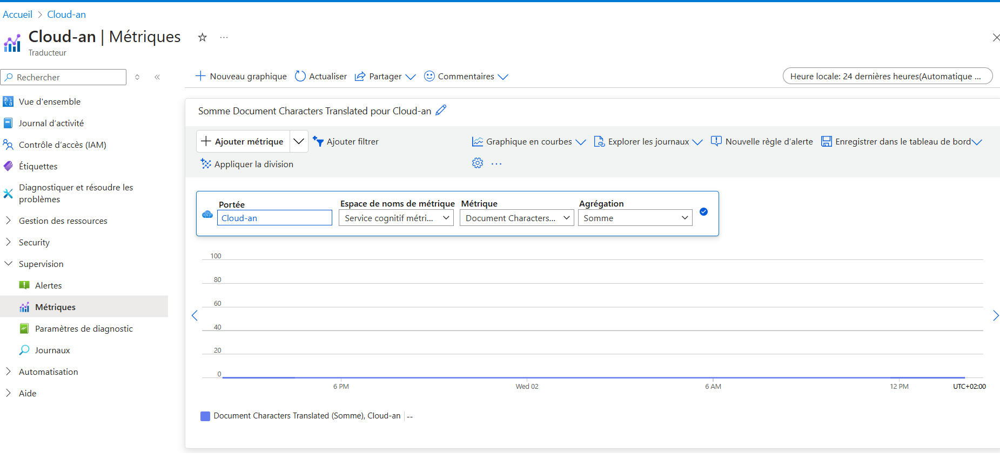

## Lab 8 : Utilisation des services cognitifs Azure

## Prérequis

- Un compte Azure actif.
- Accès au portail Azure ([https://portal.azure.com](https://portal.azure.com)).
- Droits suffisants pour créer des ressources dans Azure.

---

## Table des matières

1. **Créer une ressource de services cognitifs**
2. **Développer une application qui utilise l'API d'analyse de texte**
3. **Analyser le sentiment et les phrases clés à partir d'un texte d'exemple**
4. **Surveiller l'utilisation de l'API et gérer les clés**

---

### Étapes à suivre

1. **Créer une ressource de services cognitifs** :
   - Allez dans **Ressources de services cognitifs**, puis cliquez sur **Créer**.


2. **Développer une application qui utilise l'API d'analyse de texte** :
   - Configurez les accès à l'API et développez votre application pour utiliser l'API.


   ```bash
pip install requests
 ```

3. **Analyser le sentiment et les phrases clés à partir d'un texte d'exemple** :
   - Utilisez l'API pour envoyer des requêtes et recevoir des analyses.



4. **Surveiller l'utilisation de l'API et gérer les clés** :
   - Vérifiez l'utilisation dans le portail et gérez vos clés API.



---